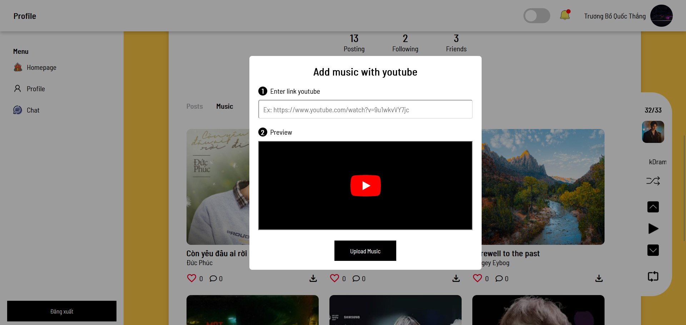
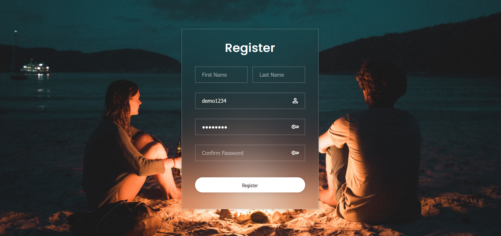
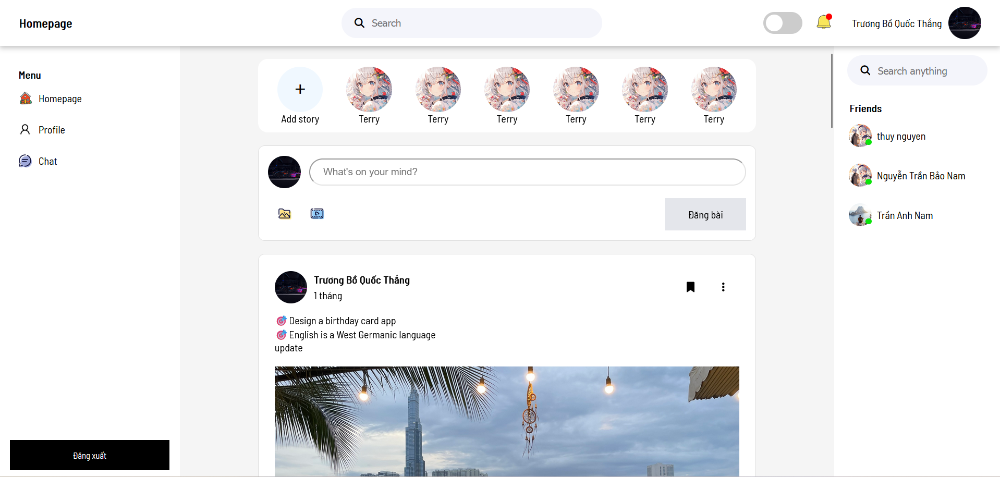
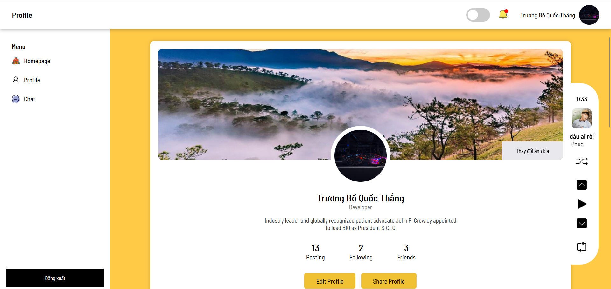
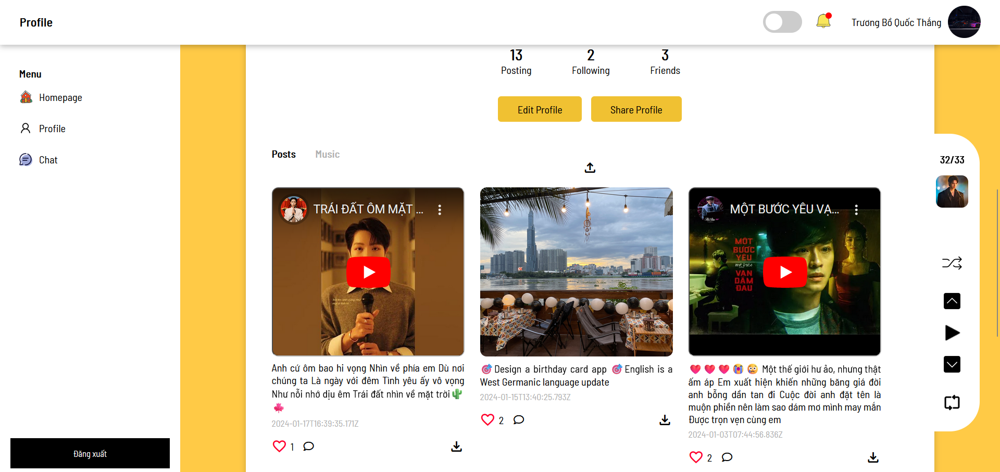
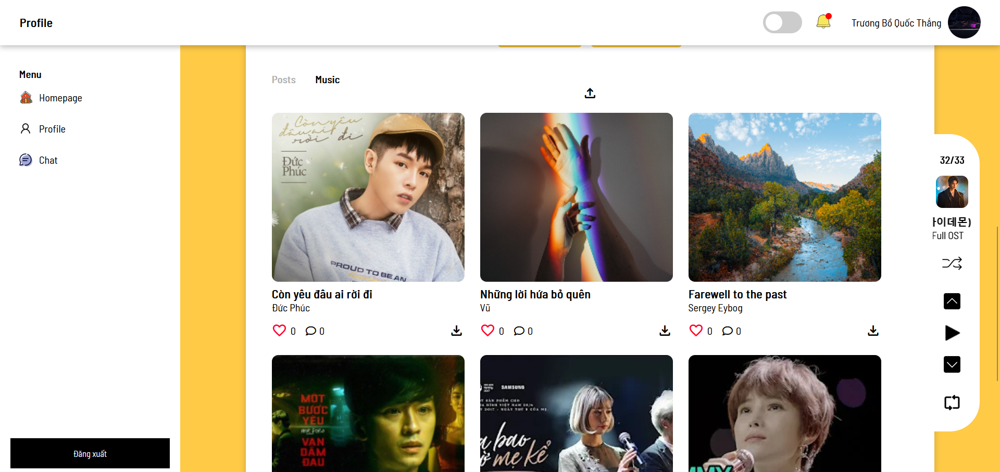
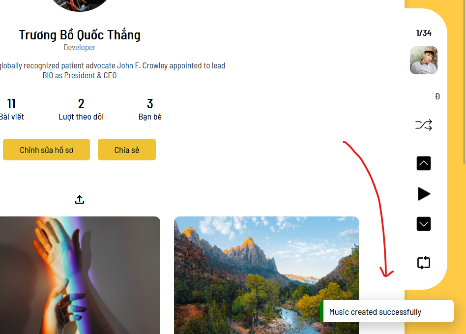
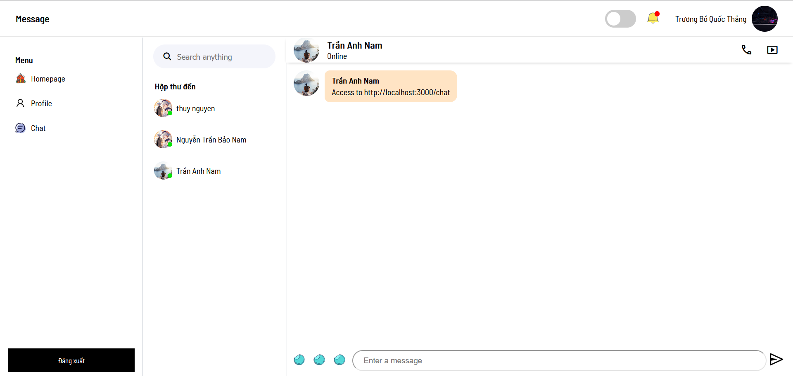

## F2C Social Media

## About F2C

**F2C Social Media** is a privacy-focused social networking platform designed for users who love music. With F2C, you can:

- Save and listen to your favorite songs without ads.

- Post, watch videos, and chat just like any other social media platform.

- Enjoy an uninterrupted experience—browse posts while listening to music in the background.

F2C is the perfect place for those who value privacy and a seamless music-streaming experience.

## Some designs

    

    

    

    

    

    

    

    

    

